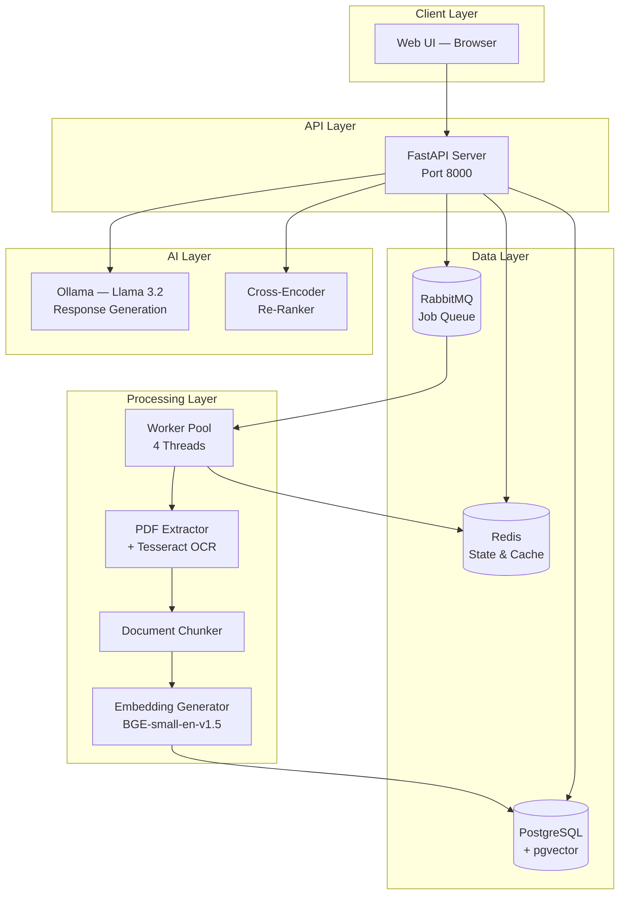
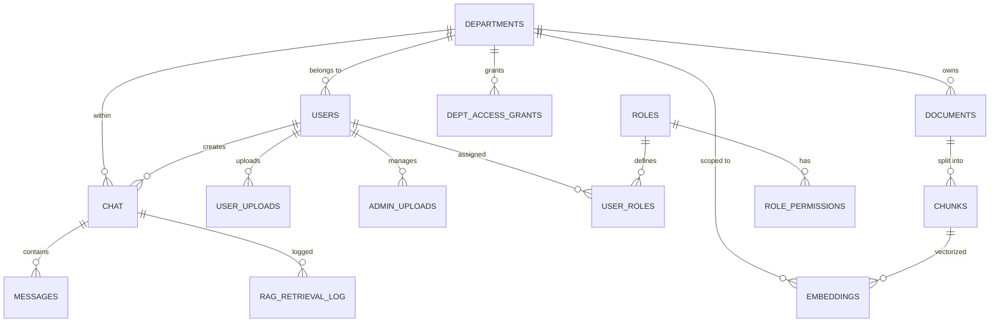
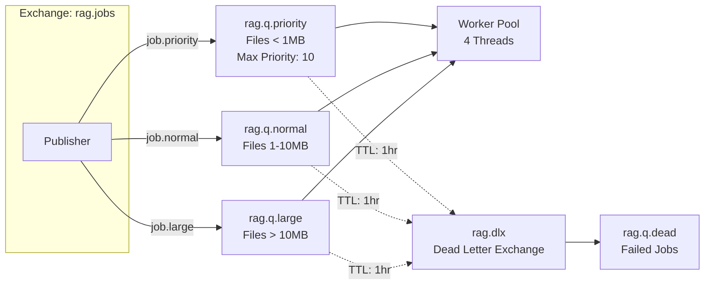

# RAG Enterprise — Technical & Product Documentation

**Version**: 1.0  
**Date**: March 23, 2026  
**Classification**: Internal — Architecture Review  

---

## Executive Summary

RAG Enterprise is an **intelligent document processing and conversational AI platform** built for organizations that need to extract knowledge from large volumes of PDF documents and make that knowledge instantly searchable through a natural-language chatbot.

The system ingests PDF files (invoices, contracts, reports), applies **Optical Character Recognition (OCR)** where needed, breaks the content into semantically meaningful chunks, generates vector embeddings, and stores everything in a queryable knowledge base. Users can then ask questions in plain language and receive precise, citation-backed answers grounded entirely in their uploaded documents.

### Why This Matters

Traditional document search is keyword-based — it fails when users don't know the exact terminology. RAG Enterprise understands *meaning*, not just words. Ask "What was the total amount on the Sithy Vinayagar invoice?" and the system finds the answer even if the word "total" never appears near the number in the original scan.

---

## Table of Contents

- [1. System Architecture](#1-system-architecture)
- [2. Technology Stack](#2-technology-stack)
- [3. Data Flow — End to End](#3-data-flow--end-to-end)
- [4. Role-Based Access Control (RBAC)](#4-role-based-access-control-rbac)
- [5. Document Processing Pipeline](#5-document-processing-pipeline)
- [6. Retrieval-Augmented Generation (RAG)](#6-retrieval-augmented-generation-rag)
- [7. Database Schema](#7-database-schema)
- [8. Message Queue Architecture](#8-message-queue-architecture)
- [9. De-Duplication & Storage Efficiency](#9-de-duplication--storage-efficiency)
- [10. Security Considerations](#10-security-considerations)
- [11. Performance & Scalability](#11-performance--scalability)
- [12. API Reference](#12-api-reference)
- [13. Deployment Guide](#13-deployment-guide)
- [14. Future Roadmap](#14-future-roadmap)

---

## 1. System Architecture

The platform follows a **microservice-inspired monolith** pattern — all services run within a single FastAPI process but are cleanly separated by responsibility. This gives us the simplicity of a monolith during early development while keeping the door open for service extraction later.



### Design Rationale

We chose this architecture because:

1. **Asynchronous Processing**: PDF ingestion (especially with OCR at 400 DPI) can take 10–60 seconds per file. By routing uploads through RabbitMQ, the user gets an instant response while workers handle the heavy lifting in the background.

2. **Real-Time Feedback**: Redis Pub/Sub powers the Server-Sent Events (SSE) stream that updates the progress bar on the UI in real time — users see each file move through OCR → Chunking → Embedding → Done.

3. **Separation of Concerns**: The API layer never touches PDF bytes directly. It simply accepts the upload, writes it to disk, and publishes a job. The worker pool handles all compute-intensive operations.

---

## 2. Technology Stack

| Layer | Technology | Purpose | Why This Choice |
|-------|-----------|---------|-----------------|
| **Web Framework** | FastAPI (Python 3.10+) | REST API + SSE streaming | Async-first, auto-generated docs, type safety |
| **Database** | PostgreSQL 15 + pgvector | Documents, chunks, embeddings, RBAC | Battle-tested RDBMS with native vector similarity search |
| **Cache / State** | Redis 7 | Session state, progress tracking, de-duplication | Sub-millisecond reads, Pub/Sub for real-time events |
| **Message Broker** | RabbitMQ 3.12 | Async job queue with priority routing | Dead-letter exchanges, delivery guarantees, priority queues |
| **Embedding Model** | BAAI/bge-small-en-v1.5 | 384-dim sentence embeddings | Best accuracy-to-speed ratio for enterprise search |
| **LLM** | Ollama (Llama 3.2) | Natural language response generation | Runs locally, no API costs, full data privacy |
| **Re-Ranker** | cross-encoder/ms-marco-MiniLM-L-6-v2 | Second-pass relevance scoring | Dramatically improves answer quality over vector-only search |
| **OCR Engine** | Tesseract 5 + pdf2image | Scanned PDF text extraction | Open-source, supports 100+ languages |
| **PDF Parser** | pypdf | Native text extraction | Fast, zero-dependency parsing for digital PDFs |

---

## 3. Data Flow — End to End

### 3.1 Document Ingestion

This is what happens when a user clicks **"Upload Files"** in the UI:

```
┌─────────┐    ┌──────────┐    ┌───────────┐    ┌──────────┐    ┌──────────────┐
│  User   │───▶│ FastAPI  │───▶│ RabbitMQ  │───▶│  Worker  │───▶│ PostgreSQL   │
│ Browser │    │ /upload  │    │  Queue    │    │  Thread  │    │ + pgvector   │
└─────────┘    └──────────┘    └───────────┘    └──────────┘    └──────────────┘
                    │                                │
                    ▼                                ▼
               ┌──────────┐                    ┌──────────┐
               │  Redis   │◀───────────────────│ Progress │
               │ Session  │    SSE updates     │ Updates  │
               └──────────┘                    └──────────┘
```

**Step-by-step:**

1. **Upload**: Browser sends multipart form with PDF files + user/department context
2. **Session Creation**: API creates a `BatchSession` in Redis, registers each file as `FileProgress`
3. **Job Publishing**: Each file becomes a `JobPayload` message on RabbitMQ (routed by size: priority / normal / large)
4. **Worker Pickup**: One of 4 worker threads picks up the job from its queue
5. **Validation**: Magic bytes check (`%PDF-`), page count extraction
6. **De-Duplication**: SHA-256 hash compared against Redis cache and PostgreSQL — if already processed, instantly marked as SKIPPED
7. **OCR**: If native text extraction yields < 50 chars/page, falls back to Tesseract OCR at **400 DPI**
8. **Chunking**: Entire document treated as a single semantic unit (document-based chunking)
9. **Embedding**: Text encoded into a 384-dimensional vector using BGE-small
10. **Storage**: Document, chunks, and embeddings written to PostgreSQL with full department scoping
11. **Progress**: Each stage publishes a Redis Pub/Sub event → SSE → browser progress bar

### 3.2 Query & Response

```
┌─────────┐    ┌──────────┐    ┌───────────┐    ┌──────────┐    ┌──────────┐
│  User   │───▶│ FastAPI  │───▶│  Vector   │───▶│Re-Ranker │───▶│  Ollama  │
│ Question│    │ /query   │    │  Search   │    │CrossEnc. │    │ Llama3.2 │
└─────────┘    └──────────┘    └───────────┘    └──────────┘    └──────────┘
                                     │                                │
                                     ▼                                ▼
                               ┌───────────┐                   ┌──────────┐
                               │ Top-20    │                   │ Answer + │
                               │ Candidates│                   │Citations │
                               └───────────┘                   └──────────┘
```

**Step-by-step:**

1. **Embed Query**: User's question is encoded into the same 384-dim vector space
2. **Vector Search**: pgvector finds the top-20 most semantically similar chunks (cosine similarity), scoped to the user's department
3. **Cross-Encoder Re-Rank**: A second neural model scores each candidate against the question for fine-grained relevance → top-5 selected
4. **Prompt Construction**: Selected chunks are formatted into a structured prompt with source attribution
5. **LLM Generation**: Ollama (Llama 3.2) generates a grounded answer using only the provided context
6. **Post-Processing**: Citations extracted, answer quality assessed, chat history stored

---

## 4. Role-Based Access Control (RBAC)

The system implements a **three-tier access model** designed for enterprise departmental isolation:

### 4.1 Role Definitions

| Role | Scope | Capabilities |
|------|-------|-------------|
| **Super Admin** | Global | View all chats across departments, access audit logs, upload files to any department, manage cross-department access grants |
| **Department Admin** | Department | Upload files for their department, view department chats, manage users within their department, grant temporary access to other departments |
| **Department User** | Department | Upload personal files, chat with the AI, view answers scoped to their department's knowledge base |

### 4.2 Data Isolation

Every piece of data in the system is tagged with a `department_id`:
- **Documents** belong to a department
- **Chunks** inherit their document's department
- **Embeddings** are scoped to a department
- **Vector search** filters by `department_id` at the SQL level

This means a user in the **Engineering** department can never see documents uploaded by **Marketing** — unless a Department Admin explicitly grants cross-department access.

### 4.3 Cross-Department Access Grants

Department Admins can grant **time-limited read access** to another department:

```sql
INSERT INTO dept_access_grants
  (granting_dept_id, receiving_dept_id, granted_by, access_type, expires_at)
VALUES ($1, $2, $3, 'read', NOW() + INTERVAL '3 hours');
```

When the grant expires, the receiving department's queries automatically stop returning the granting department's documents. No manual cleanup needed.

### 4.4 Audit Trail

Every administrative action is logged in the `admin_actions` table:
- Department access grants
- Role assignments
- Admin file uploads
- User management actions

Each entry includes the admin's user ID, department, action type, target, and a JSON metadata payload for full forensic traceability.

---

## 5. Document Processing Pipeline

### 5.1 PDF Extraction Strategy

The system uses a **two-pass extraction** approach:

**Pass 1 — Native Text Extraction** (`pypdf`)
- Fast, lossless extraction for digitally-created PDFs
- If a page yields ≥ 50 characters, we trust the native text

**Pass 2 — OCR Fallback** (`Tesseract + pdf2image`)
- Triggered when average chars/page falls below 50
- Converts each page to a **400 DPI image** (configurable)
- Tesseract OCR extracts text from the rendered image
- Handles scanned invoices, handwritten notes, photographed documents

### 5.2 Why 400 DPI?

| DPI | Quality | Speed | Use Case |
|-----|---------|-------|----------|
| 150 | Low — misses small fonts | Fast | Quick previews |
| 300 | Good — standard documents | Moderate | General OCR |
| **400** | **Excellent — captures fine print** | **Slower** | **Invoices, legal docs, complex layouts** |
| 600 | Overkill — diminishing returns | Very slow | Archival scanning |

We chose 400 DPI because our primary use case involves invoices with small-font line items, GSTIN numbers, and financial figures where every character matters.

### 5.3 Document-Based Chunking

Unlike traditional fixed-size chunking (which splits arbitrarily at 500-token boundaries), we use **document-based chunking**:

- Each PDF becomes **one semantic chunk** containing all extracted text
- This preserves cross-page context (e.g., an invoice number on page 1 connected to a total on page 3)
- Works exceptionally well for invoices, forms, and short reports

**Trade-off**: For very long documents (100+ pages), this approach may exceed embedding model context limits. Future versions will implement adaptive chunking based on document length.

### 5.4 Text Cleaning Pipeline

```python
1. Remove excessive blank lines (3+ → 2)
2. Remove orphan page numbers
3. Join soft line breaks (within paragraphs)
4. Normalize whitespace
5. Strip page markers ([Page N] artifacts)
6. Reject documents with < 10 words (OCR noise)
```

---

## 6. Retrieval-Augmented Generation (RAG)

### 6.1 The RAG Pattern

RAG solves the fundamental limitation of LLMs: they don't know your private data. By retrieving relevant documents before generating a response, we get:

- **Accuracy**: Answers are grounded in actual documents, not hallucinated
- **Currency**: New documents are searchable within seconds of upload
- **Verifiability**: Every answer comes with source citations

### 6.2 Two-Stage Retrieval

**Stage 1: Vector Similarity (Recall)**
- Query embedded using the same model (`bge-small-en-v1.5`)
- pgvector performs approximate nearest neighbor search
- Returns top-20 candidates ranked by cosine similarity
- Department-scoped: only searches within the user's department + granted departments

**Stage 2: Cross-Encoder Re-Ranking (Precision)**
- A cross-encoder model (`ms-marco-MiniLM-L-6-v2`) scores each (query, document) pair
- Unlike embedding similarity, cross-encoders see both texts simultaneously — much more accurate
- Top-5 candidates selected after re-ranking

### 6.3 Prompt Engineering

```
Context:
[1] Document: invoice_042.pdf
{full text of most relevant chunk}

[2] Document: purchase_order.pdf
{full text of second most relevant chunk}

...

Question: {user's question}
Answer ONLY based on the context above. If information is not in the document, say so.
```

The instruction to answer **only from context** is critical — it prevents the LLM from filling gaps with its pre-trained knowledge, which may be wrong for domain-specific data.

---

## 7. Database Schema

### 7.1 Entity Relationship Overview



### 7.2 Core Tables

| Table | Purpose | Key Columns |
|-------|---------|-------------|
| `departments` | Organizational units | `id`, `name`, `is_active` |
| `users` | System users | `id`, `email`, `department_id`, `is_super_admin` |
| `documents` | Processed PDFs | `id`, `department_id`, `content_hash`, `embed_status` |
| `chunks` | Text segments | `id`, `document_id`, `chunk_text`, `chunk_index` |
| `embeddings` | Vector representations | `id`, `chunk_id`, `department_id`, `embedding vector(384)` |
| `chat` | Conversation sessions | `id`, `user_id`, `department_id`, `title` |
| `messages` | Chat messages | `id`, `chat_id`, `role`, `content` |
| `user_uploads` | User file tracking | `id`, `user_id`, `processing_status` |
| `admin_uploads` | Admin file tracking | `id`, `admin_user_id`, `is_shared_globally` |
| `admin_actions` | Audit log | `id`, `action_type`, `metadata JSONB` |
| `dept_access_grants` | Cross-department access | `granting_dept_id`, `receiving_dept_id`, `expires_at` |
| `roles` | Role definitions | `id`, `role_name`, `scope` |
| `role_permissions` | Fine-grained permissions | `role_id`, `permission_key` |

### 7.3 Indexing Strategy

```sql
-- Vector similarity search (IVFFlat for approximate nearest neighbors)
CREATE INDEX idx_emb_vector ON embeddings
  USING ivfflat (embedding vector_cosine_ops) WITH (lists=100);

-- Department-scoped queries
CREATE INDEX idx_emb_dept ON embeddings(department_id);
CREATE INDEX idx_doc_dept ON documents(department_id);

-- De-duplication lookups
CREATE INDEX idx_doc_hash ON documents(content_hash);

-- Chat and message retrieval
CREATE INDEX idx_msg_chat ON messages(chat_id);
CREATE INDEX idx_chat_dept ON chat(department_id);
```

---

## 8. Message Queue Architecture

### 8.1 Queue Topology



### 8.2 Routing Logic

| File Size | Queue | Rationale |
|-----------|-------|-----------|
| < 1 MB | `rag.q.priority` | Small files processed first for instant feedback |
| 1–10 MB | `rag.q.normal` | Standard processing |
| > 10 MB | `rag.q.large` | Large files don't block smaller ones |

### 8.3 Failure Handling

- **Retry Policy**: Failed jobs are retried up to **3 times** with automatic re-queuing
- **Dead Letter**: After 3 failures, the job moves to `rag.q.dead` for manual inspection
- **TTL**: Messages expire after **1 hour** if not consumed (prevents queue buildup)
- **Progress Tracking**: Each retry updates the file's status in Redis, visible on the UI

---

## 9. De-Duplication & Storage Efficiency

### 9.1 How It Works

Every uploaded file is fingerprinted using **SHA-256**:

```python
content_hash = hashlib.sha256(raw_bytes).hexdigest()
```

Before processing, the system checks:
1. **Redis cache**: `rag:dedup:{hash}` — instant lookup (sub-millisecond)
2. **PostgreSQL**: `documents.content_hash` — persistent fallback

If a match is found, the file is marked as **SKIPPED** and the progress bar instantly jumps to 100%. No OCR, no chunking, no embedding — zero wasted compute.

### 9.2 Cache TTL

The de-duplication cache persists for **1 year** in Redis. This means:
- Re-uploading the same invoice 6 months later → instant skip
- Modified version of the same file → new hash → full reprocessing
- Different file with same name → hash differs → full reprocessing

### 9.3 Storage Impact

Without de-duplication, uploading 50 invoices twice would create:
- 100 document records, 100 chunk records, 100 embedding vectors

With de-duplication:
- 50 document records, 50 chunk records, 50 embedding vectors
- **50% storage savings** on duplicate uploads

---

## 10. Security Considerations

### 10.1 Data Isolation
- All queries are department-scoped at the SQL level
- No application-level filtering — the database enforces boundaries
- Cross-department access requires explicit grants with expiration

### 10.2 Audit Logging
- Every administrative action is recorded with timestamp, user ID, and metadata
- Audit logs are immutable (INSERT-only, no UPDATE/DELETE)
- Queryable by department for compliance reporting

### 10.3 Areas for Future Hardening
- **Authentication**: Currently uses role switching in UI; production needs JWT/OAuth2
- **Encryption**: File uploads should be encrypted at rest
- **Rate Limiting**: Framework is in place (Redis-based), needs enforcement in API middleware
- **Input Sanitization**: LLM prompts should be sanitized against injection attacks

---

## 11. Performance & Scalability

### 11.1 Current Configuration

| Parameter | Value | Tunable |
|-----------|-------|---------|
| Worker threads | 4 | `cfg.upload_workers` |
| OCR resolution | 400 DPI | `cfg.ocr_dpi` |
| Max file size | 200 MB | `cfg.max_pdf_size_mb` |
| Max pages/file | 2,000 | `cfg.max_pdf_pages` |
| Max batch size | 100 files | `cfg.max_batch_files` |
| Embedding batch | 32 | `cfg.embedding_batch` |
| Vector top-k | 20 | `cfg.top_k_retrieval` |
| Re-rank top-k | 5 | `cfg.top_k_rerank` |
| Similarity threshold | 0.70 | `cfg.similarity_threshold` |

### 11.2 Observed Latencies

| Operation | Typical Latency | Notes |
|-----------|----------------|-------|
| Native PDF extraction | 0.5–2s | Depends on page count |
| OCR (400 DPI, 5 pages) | 15–45s | CPU-bound, parallelizable |
| Embedding (1 chunk) | 50–200ms | GPU would reduce to ~10ms |
| Vector search (20 results) | 5–15ms | pgvector IVFFlat index |
| Cross-encoder re-rank | 100–300ms | CPU-bound |
| LLM generation | 2–10s | Depends on response length |
| **Total query latency** | **3–12s** | End-to-end |

### 11.3 Scaling Path

| Phase | Approach |
|-------|----------|
| **Vertical** | Increase worker count, add GPU for embeddings + re-ranking |
| **Horizontal** | Run multiple worker processes across machines, all consuming from the same RabbitMQ queues |
| **Database** | pgvector supports HNSW indexes for faster ANN search; consider read replicas for query scaling |
| **Caching** | Add a Redis-based query cache to avoid re-running identical queries |

---

## 12. API Reference

### 12.1 Endpoints

| Method | Path | Description |
|--------|------|-------------|
| `POST` | `/upload/pdfs` | Upload one or more PDF files for processing |
| `GET` | `/upload/progress/{session_id}` | SSE stream of file processing progress |
| `POST` | `/query` | Ask a question against the knowledge base |
| `GET` | `/admin/chats` | List all chat sessions (admin-scoped) |
| `GET` | `/admin/audit` | Retrieve audit log entries |
| `GET` | `/status` | System health check + user list |
| `GET` | `/ui` | Serve the web interface |

### 12.2 Upload Example

```bash
curl -X POST http://localhost:8000/upload/pdfs \
  -F "files=@invoice1.pdf" \
  -F "files=@invoice2.pdf" \
  -F "user_id=cc60fa97-..." \
  -F "dept_id=f73d9d44-..."
```

**Response:**
```json
{
  "session_id": "9427b7e3-b1e6-4939-9952-d5931d17b08c",
  "files": 2
}
```

### 12.3 Query Example

```bash
curl -X POST http://localhost:8000/query \
  -F "question=What is the total amount on the Ultratech invoice?" \
  -F "user_id=cc60fa97-..." \
  -F "dept_id=f73d9d44-..."
```

**Response:**
```json
{
  "answer": "The total amount on the Ultratech Cement invoice is ₹14,500...",
  "has_answer": true,
  "citations": ["invoice_042.pdf"],
  "chunk_count": 3,
  "latency_ms": 4532.1,
  "chat_id": "a1b2c3d4-..."
}
```

---

## 13. Deployment Guide

### 13.1 Prerequisites

| Service | Version | Purpose |
|---------|---------|---------|
| Python | 3.10+ | Runtime |
| PostgreSQL | 15+ with pgvector extension | Primary database |
| Redis | 7+ | State management |
| RabbitMQ | 3.12+ | Job queue |
| Tesseract | 5+ | OCR engine |
| Ollama | Latest | Local LLM serving |
| Poppler | Latest | PDF-to-image conversion |

### 13.2 Environment Variables

```env
PG_HOST=192.168.1.109
PG_PORT=5432
PG_DATABASE=ragchat
PG_USER=postgres
PG_PASSWORD=****

REDIS_HOST=localhost
REDIS_PORT=6379

RABBIT_HOST=localhost
RABBIT_PORT=5672
RABBIT_USER=guest
RABBIT_PASS=guest
```

### 13.3 Quick Start

```bash
# 1. Install dependencies
pip install -r requirements.txt

# 2. Ensure PostgreSQL has pgvector extension
psql -c "CREATE EXTENSION IF NOT EXISTS vector;"

# 3. Pull the LLM model
ollama pull llama3.2

# 4. Start the application
python main.py

# 5. Open the UI
# Navigate to http://localhost:8000/ui
```

---

## 14. Future Roadmap

### Phase 2 — Authentication & Multi-Tenancy
- JWT/OAuth2-based user authentication
- Self-service user registration
- SSO integration (Azure AD, Google Workspace)

### Phase 3 — Advanced Document Processing
- Adaptive chunking (sentence-level for long documents, document-level for short ones)
- Table extraction with structural preservation
- Multi-language OCR support (Hindi, Telugu, Tamil)
- Image and chart understanding via vision models

### Phase 4 — Conversational Intelligence
- Multi-turn conversation memory
- Follow-up question awareness
- Document comparison ("Compare invoice A vs invoice B")
- Automated report generation

### Phase 5 — Enterprise Integration
- REST API client SDKs (Python, JavaScript)
- Webhook notifications on document processing completion
- Integration with ERP systems (SAP, Oracle)
- Scheduled batch ingestion from shared drives

---

## Project Structure

```
Rag_full_pipeline/
├── main.py                          # Application entry point & lifecycle
├── requirements.txt                 # Python dependencies
├── uploads/                         # Temporary file storage
└── src/
    ├── config.py                    # Centralized configuration
    ├── api/
    │   └── routes.py                # FastAPI routes + embedded UI
    ├── database/
    │   ├── postgres_db.py           # Schema, RBAC manager, vector search
    │   ├── redis_db.py              # State manager, de-duplication, Pub/Sub
    │   └── rabbitmq_broker.py       # Queue topology, job publishing
    ├── models/
    │   └── schemas.py               # Data classes (JobPayload, FileProgress, etc.)
    ├── services/
    │   └── rag_pipeline.py          # PDF extraction, chunking, embedding, RAG query
    └── worker/
        └── pool.py                  # Multi-threaded worker pool
```

---

> **Document prepared for Architecture Review Board and Client Presentation**  
> For questions or clarifications, please reach out to the Engineering team.
